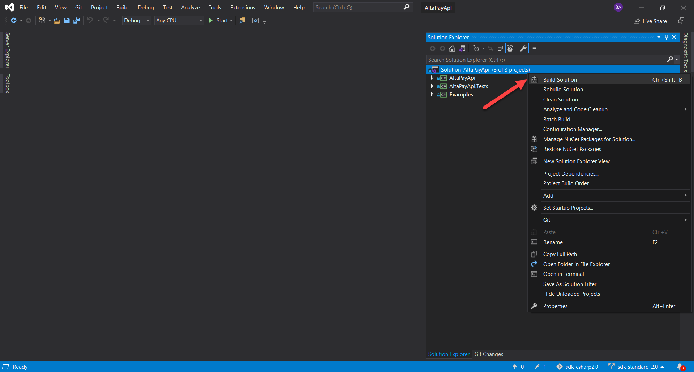

Altapay - API C_Sharp
=====================

C_Sharp is a Client library that is used as a bridge between customer .Net solutions and Altapay gateway.

Note: To build this project upgrade to .NetFramework 4.6.1 or greater. If the target framework version is below 4.6.1. .NetStandard 2.0 SDK is unable to refer

### Build package

1- Clone a repository 

    $ git clone https://github.com/AltaPay/sdk-csharp2.0.git

2- Open Visual Studio 2019 and go to File → Open → Project/Solution.

3- Select the .sln file located in the Altapay directory.

4- Right-click on the solution file and click Build Solution to build the package.

### 1.0.0

- Supports API changes from 20210324

## License

See [LICENSE](LICENSE)